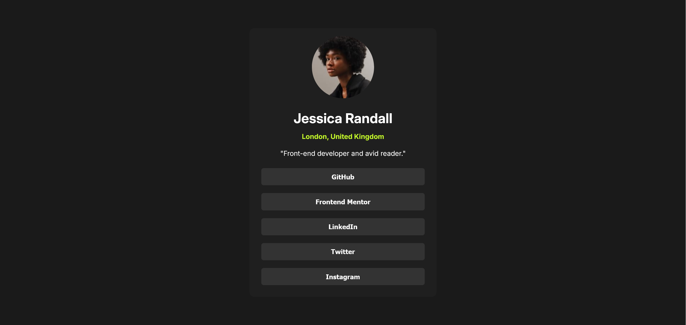

# Frontend Mentor - Social links profile solution

This is a solution to the [Social links profile challenge on Frontend Mentor](https://www.frontendmentor.io/challenges/social-links-profile-UG32l9m6dQ). Frontend Mentor challenges help you improve your coding skills by building realistic projects. 

## Table of contents

- [Overview](#overview)
  - [The challenge](#the-challenge)
  - [Screenshot](#screenshot)
  - [Links](#links)
  - [Built with](#built-with)
  - [What I learned](#what-i-learned)

## Overview

### The challenge

Users should be able to:

- See hover and focus states for all interactive elements on the page

### Screenshot

### Links

- Solution URL: [Solution](https://www.frontendmentor.io/solutions/mobile-first-responsive-social-links-profile-v_mWPntHpR)
- Live Site URL: [Live Site](https://jthuynh.github.io/frontendmentor/social-links-profile/)

### Built with

- Semantic HTML5 markup
- CSS custom properties
- Flexbox
- Mobile-first workflow

### What I learned

Used this challenge to learn about css variables, rems/ems, and dvh/dvw to create responsive web pages. The :focus-visible psuedo class allows the user to use tab to navigate through the page. I've also learned how to load and use custom fonts with this [resource](https://www.digitalocean.com/community/tutorials/how-to-load-and-use-custom-fonts-with-css#loading-a-self-hosted-font-with-font-face).